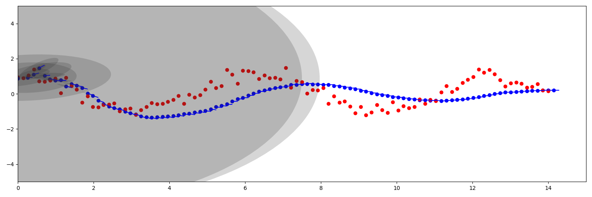

# Kalman Filter

That repository contains the Python3 implementation of a Kalman Filter with the exemplary 
script of usage in the localization task. The code was written for purely educational purposes.

## Usage

Before you start install *matplotlib* and *numpy* libraries. 
To see the results just run: 

```
python localization_2d.py
```

Output should be like the image below. Red dots represent noisy measurements, blue dots with blue arrows
represent predicted locations with velocity vectors. 
Uncertainty probability functions were marked as grey ellipses.
